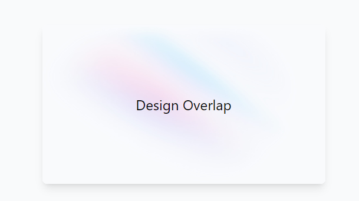

# Overlapping Content Dengan CSS Grid

Salah satu component yang sering kita buat adalah _overlapping content_. Dimana terdapat suatu kontent sebagai _background_ (untuk kasus ini adalah _image_) dan kita menempatkan text kita tepat di atas _background image_ tersebut.&#x20;

<figure><figcaption><p>Text di depan background image</p></figcaption></figure>

## Menggunakan Position

Cara yang pertama menggunakan kombinasi _position absolute_ dan _relative_. Di mana _parent container_ menjadi _relative_ dan _background_ yang diinginkan menjadi _absoulte_ dengan _inset_ 0 untuk meng-cover semua _container_.

````html
```html
<div class="flex h-screen flex-col justify-center items-center bg-gray-50 py-6 sm:py-12">
  <div class="relative w-[480px] h-[270px] bg-white rounded-lg shadow-lg overflow-hidden">
    
    <p class="text-2xl text-center flex items-center justify-center relative h-full">Design Overlap</p>
  </div>
</div>
```
````

Dengan pendekatan ini tujuan kita untuk overlapping content tercapai. Tetapi element image yang menjadi background kehilangan _flow_ pada document html kita sehingga element _paragraph_ menjadi naik ke atas. Agar text nya dapat diletakkan di tengah. Maka, perlu penambahan height pada _parent_ dan height 100% agar komponen _paragraph_ memiliki tinggi yang sama dengan parent.

### Menggunakan CSS Grid

Cara yang lebih efisien adalah dengan menggunakan CSS Grid. Parent element menjadi _display grid_ dan semua _grid item_ memiliki _colum_ 1 dan _row_ 1 sehingga semua element akan saling overlapping.

````html
```html
<div class="flex h-screen flex-col justify-center items-center bg-gray-50 py-6 sm:py-12">
  <div class="w-[480px] bg-white rounded-lg shadow-lg grid [&>*]:col-[1] [&>*]:row-[1] overflow-hidden">
    
    <p class="text-2xl text-center flex items-center justify-center">Design Overlap</p>
  </div>
</div>
```
````

Untuk mengubah semua _grid item_ dari _parent_ kita dapat menggunakan \[&>\*] yang artinya semua _element direct children._ Dengan menggunakan pendekatan ini, _element image_ tidak kehilangan _flow_ nya pada document sehingga pada _parent_ tidak perlu menambahkan _height_ karena akan menyesuaikan _height_ dari _grid item_.
