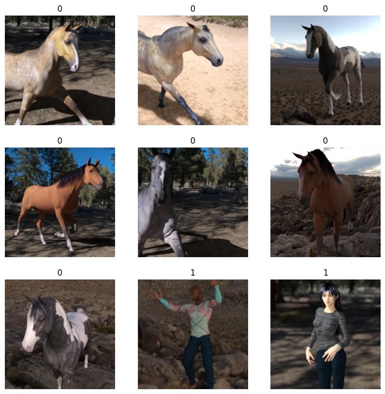

# Pratrain Model

Deklarasi library yang digunakan untuk pretrain model

````
```python
import numpy as np
import keras
from keras import layers
import tensorflow_datasets as tfds
import matplotlib.pyplot as plt
from sklearn.metrics import confusion_matrix, classification_report
import pandas as pd
import seaborn as sns
from tensorflow.keras.callbacks import EarlyStopping
import tensorflow as tf
```
````

Load dataset horses dan human, dataset dibagi menjadi 3 antara lain:

* Train -> Digunakan dalam proses pelatihan model. Dengan banyak variasi gambar , model dapat mempelajari berbagai ekstraksi fitur."
* Validation -> Digunakan ketika proses training berjalan, setiap sekali iterasi setelah training berjalan akan melakukan evaluasi model
* Test -> Digunakan ketika pelatihan model telah selesai, untuk mengukur akurasi model kembali dalam mengenal object gambar

Untuk persentase training-nya dibagi jadi 3, 80% untuk Training, 10% untuk validasi, 10% untuk test


````
```python
tfds.disable_progress_bar()

train_ds, validation_ds, test_ds = tfds.load(
    "horses_or_humans",
    # Reserve 10% for validation and 10% for test
    split=["train[:40%]", "train[40%:50%]", "train[50%:60%]"],
    as_supervised=True,  # Include labels
) # Only keep examples with label < 2

print(f"Number of training samples: {train_ds.cardinality()}")
print(f"Number of validation samples: {validation_ds.cardinality()}")
print(f"Number of test samples: {test_ds.cardinality()}")
```
````

Menampilkan sample gambar berserta label dalam suatu dataset.\
Untuk horse dilabelkan dengan angka 0 serta human dilabelkan dalam angka 1.

````
```python
plt.figure(figsize=(10, 10))
for i, (image, label) in enumerate(train_ds.take(9)):
    ax = plt.subplot(3, 3, i + 1)
    plt.imshow(image)
    plt.title(int(label))
    plt.axis("off")
```
````

<figure><figcaption></figcaption></figure>

Selanjutnya resize tinggi lebar image, tinggi lebar image ini perlu sesuai dengan value input shape ketika meracik komponen untuk train model.


````
```python
resize_fn = keras.layers.Resizing(150, 150)

train_ds = train_ds.map(lambda x, y: (resize_fn(x), y))
validation_ds = validation_ds.map(lambda x, y: (resize_fn(x), y))
test_ds = test_ds.map(lambda x, y: (resize_fn(x), y))
```
````

Selanjutnya image augumentasi, dengan image augumentasi ini diharapkan menambah beberapa variasi image, sehingga model dapat berlatih dengan variasi gambar dengan kondisi berbeda-beda.

Image augumentasina sangat berguna sekali ketika kita memiliki jumlah dataset yang sangat sedikit.


````
```python
augmentation_layers = [
    layers.RandomFlip("horizontal"),
    layers.RandomRotation(0.1),
]


def data_augmentation(x):
    for layer in augmentation_layers:
        x = layer(x)
    return x


train_ds = train_ds.map(lambda x, y: (data_augmentation(x), y))
```
````

````
```python
for images, labels in train_ds.take(1):
    plt.figure(figsize=(10, 10))
    first_image = images[0]
    for i in range(9):
        ax = plt.subplot(3, 3, i + 1)
        augmented_image = data_augmentation(np.expand_dims(first_image, 0))
        plt.imshow(np.array(augmented_image[0]).astype("int32"))
        plt.title(int(labels[0]))
        plt.axis("off")
```
````

Menampilkan sample hasil augumentasi image

<figure><figcaption></figcaption></figure>

Set batch size serta optimize loading speed ketika pelatihan model berjalan

````
```python
from tensorflow import data as tf_data

batch_size = 64

train_ds = train_ds.batch(batch_size).prefetch(tf_data.AUTOTUNE).cache()
validation_ds = validation_ds.batch(batch_size).prefetch(tf_data.AUTOTUNE).cache()
test_ds = test_ds.batch(batch_size).prefetch(tf_data.AUTOTUNE).cache()
```
````

Selanjutnya load model Xception serta beberapa parameter yang perlu diisi seperti input\_shape dengan value (150, 150, 3) angka 150, 150 berarti proses pelatihan model memilik requirement ukuran image tinggi = 150, lebar = 150, serta 3 mewaliki jenis gambar-nya, untuk value = 3 berarti gambar tersebut jenisinya RGB.

Ada beberpa keriteria lain yang perlu diperhatikan antara lain

* Freeze base model dengan memberi value \*base\_model.trainable = False\* hal ini agar ketika pelatihan model berlangsung, base model yang telah dilatih tidak dilatih kembali, karena tujuan pretrain model sendiri yaitu menggunakan base model yang telah mengerti cara belajar mengenali object, digunakan kembali untuk melatih model yang baru dalam mempelajari object yang baru, biasanya yang dilatih pada pretrain ini yaitu hanya output-nya saja.\
  Jika diilustrasikan dalam kehidupan sehari-hari misalnya bayi telah sukses belajar berjalan maka untuk belajar berlari perlu mengerti konsep berjalan dulu yang digunakan untuk belajar berlari dengan hanya menambah speed berjalan dengan lebih cepat.
* Manambah layer output untuk melatih model dalam mengklasifikasi gambar.

````
```python
base_model = keras.applications.Xception(
    weights="imagenet",  # Load weights pre-trained on ImageNet.
    input_shape=(150, 150, 3),
    include_top=False,
)  # Do not include the ImageNet classifier at the top.

# Freeze the base_model
base_model.trainable = False

# Create new model on top
inputs = keras.Input(shape=(150, 150, 3))

# Pre-trained Xception weights requires that input be scaled
# from (0, 255) to a range of (-1., +1.), the rescaling layer
# outputs: `(inputs * scale) + offset`
scale_layer = keras.layers.Rescaling(scale=1 / 127.5, offset=-1)
x = scale_layer(inputs)

# The base model contains batchnorm layers. We want to keep them in inference mode
# when we unfreeze the base model for fine-tuning, so we make sure that the
# base_model is running in inference mode here.
x = base_model(x, training=False)
x = keras.layers.GlobalAveragePooling2D()(x)
x = keras.layers.Dropout(0.2)(x)  # Regularize with dropout
outputs = keras.layers.Dense(2, activation='softmax')(x)
model = keras.Model(inputs, outputs)

model.summary(show_trainable=True)
```
````

Berikut hasil execute code diatas, menghasilkan parameter model yang akan di training.

```
┏━━━━━━━━━━━━━━━━━━━━━━━━━━━━━┳━━━━━━━━━━━━━━━━━━━━━━━┳━━━━━━━━━━━━┳━━━━━━━┓
┃ Layer (type)                ┃ Output Shape          ┃    Param # ┃ Trai… ┃
┡━━━━━━━━━━━━━━━━━━━━━━━━━━━━━╇━━━━━━━━━━━━━━━━━━━━━━━╇━━━━━━━━━━━━╇━━━━━━━┩
│ input_layer_7 (InputLayer)  │ (None, 150, 150, 3)   │          0 │   -   │
├─────────────────────────────┼───────────────────────┼────────────┼───────┤
│ rescaling_3 (Rescaling)     │ (None, 150, 150, 3)   │          0 │   -   │
├─────────────────────────────┼───────────────────────┼────────────┼───────┤
│ xception (Functional)       │ (None, 5, 5, 2048)    │ 20,861,480 │   N   │
├─────────────────────────────┼───────────────────────┼────────────┼───────┤
│ global_average_pooling2d_3  │ (None, 2048)          │          0 │   -   │
│ (GlobalAveragePooling2D)    │                       │            │       │
├─────────────────────────────┼───────────────────────┼────────────┼───────┤
│ dropout_3 (Dropout)         │ (None, 2048)          │          0 │   -   │
├─────────────────────────────┼───────────────────────┼────────────┼───────┤
│ dense_3 (Dense)             │ (None, 2)             │      4,098 │   Y   │
└─────────────────────────────┴───────────────────────┴────────────┴───────┘
```
